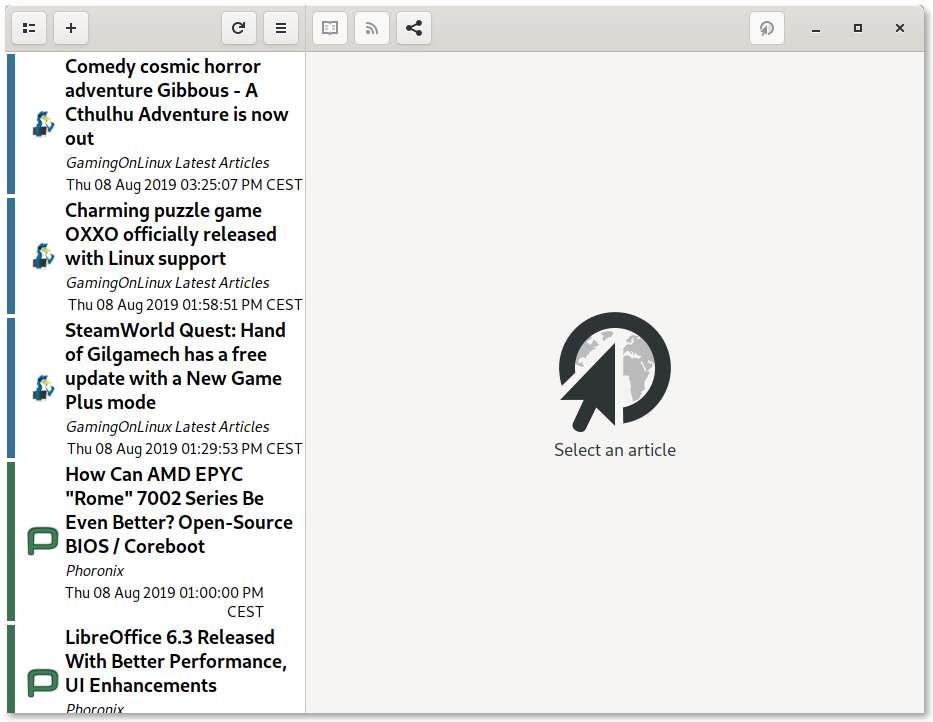
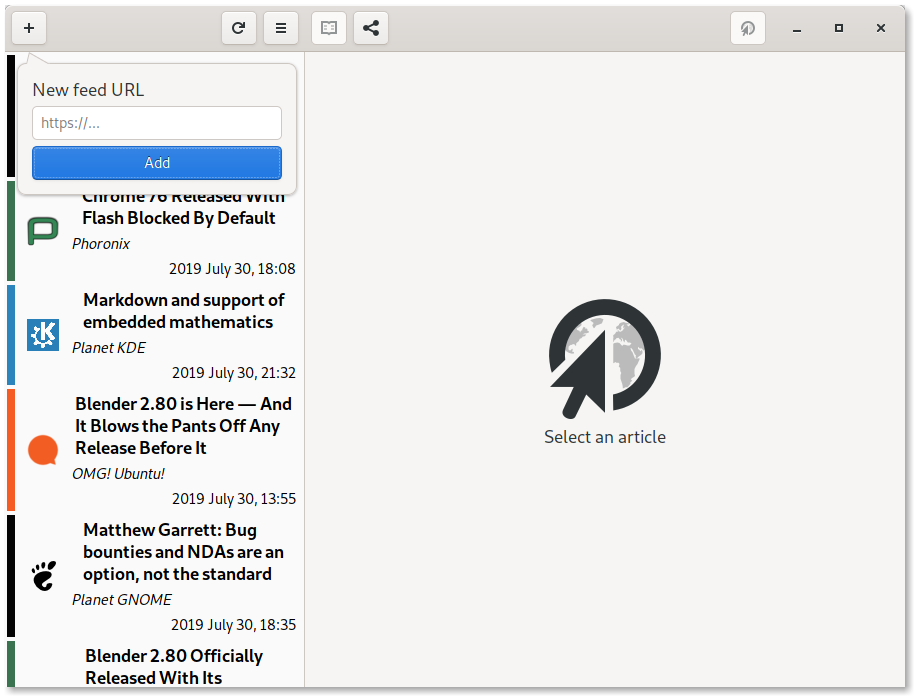
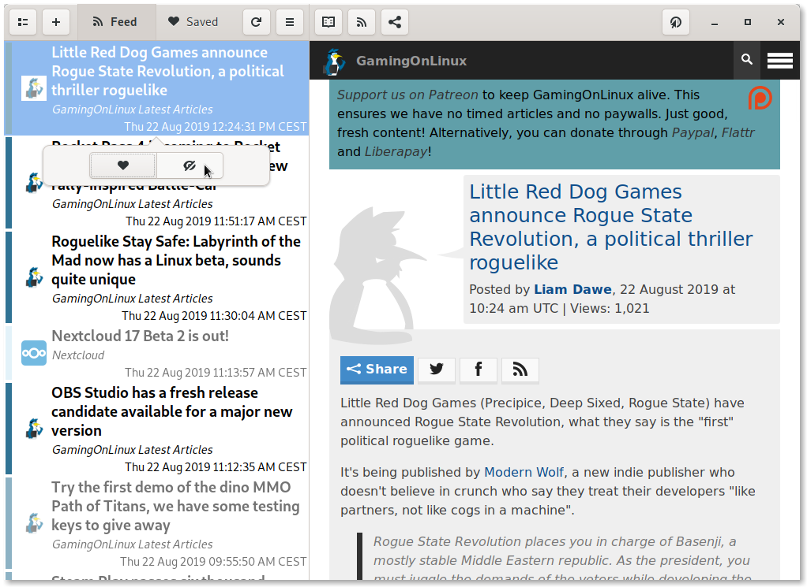
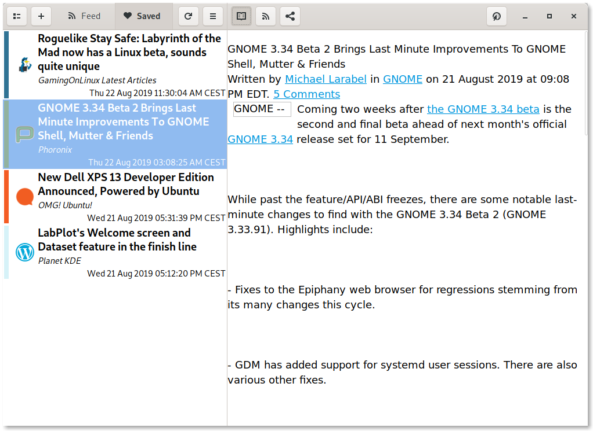
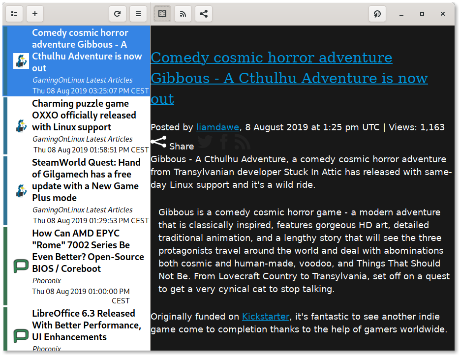
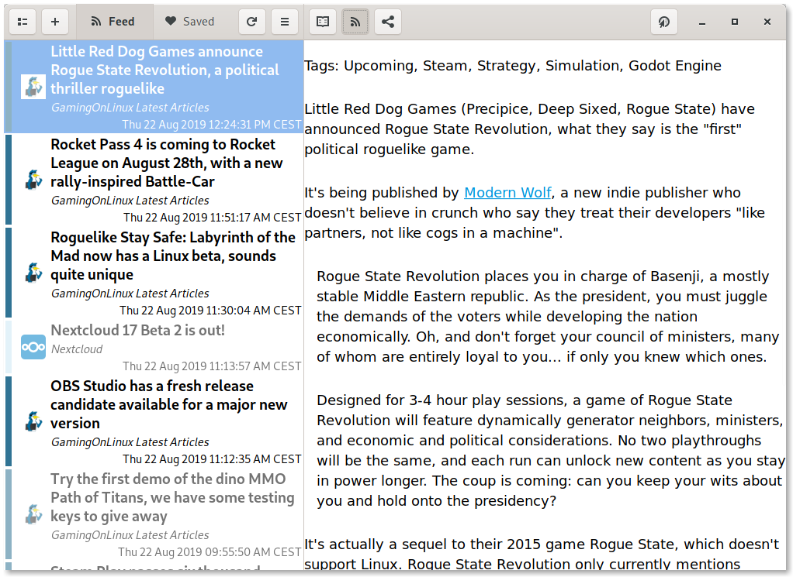
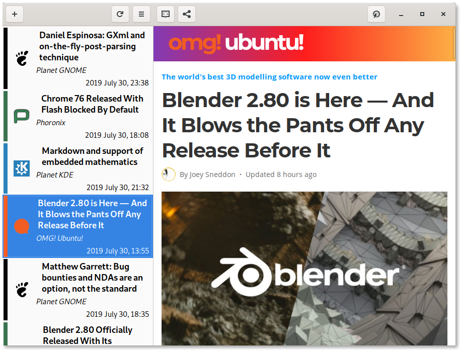
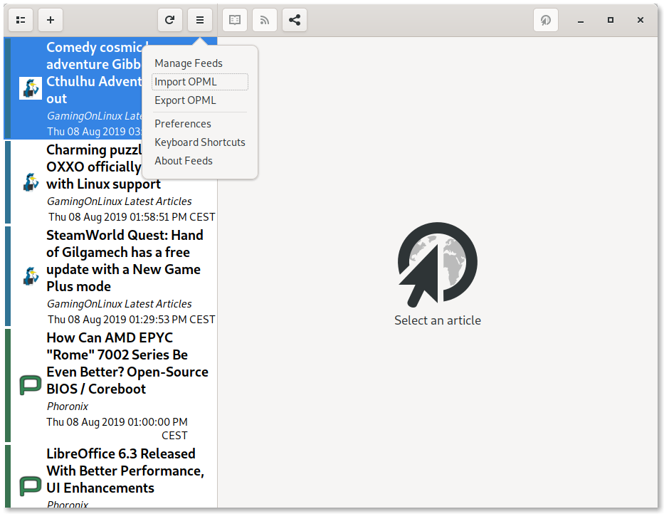
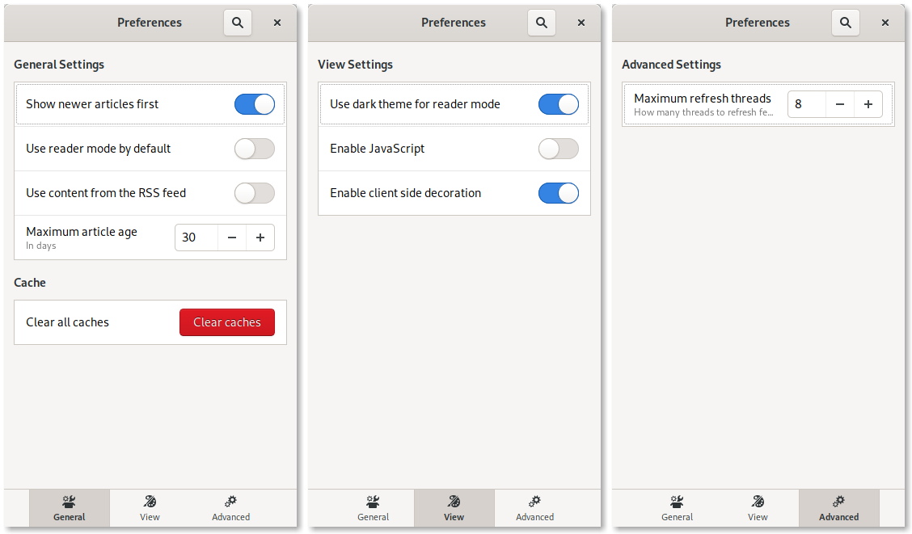

<nav>

- [ **GNOME Feeds**](#)
- [Features](#features)
- [Install](#install)
- [Hack](#hack)
- [Support](#support)

</nav>

<!--@MARGIN@-->

# GNOME Feeds

## News reader for GNOME

---

## Features

### Simple User Experience

Add your favorite feeds, and start reading the latest news.

### Read, unread

Read articles are grayed out. Mark them as read or unread with a simple right click or longpress.

### Read what matters

Filter the articles by feed and only read what you want to read.

### On the go

Save any article you want and read it offline anytime and anywhere.

### Easy on the eyes

Cut the clutter of modern websites with a large range of reading options!

Use reader mode to get to the juicy bits of an article.

Use the RSS content to glance through the essentials.

Load a full web view (with JavaScript disabled by default) to get the full experience.

### Large feed collection? Import it

GNOME Feeds supports importing and exporting your feed collection from and to OPML so that you can get set up in seconds.

### Have it your way

Customize your experience with a large range of preferences.

### Responsive

GNOME Feeds is built with Purism's libhandy library to offer a responsive user interface. Got a new shiny GNU+Linux phone? Here's a feed reader for you!

<video autoplay mute controls loop>
    <source src="screenshots/responsive_demo.mp4" type="video/mp4" />
</video>

---

## Install

### Flatpak (recommended)

[Install **Flatpak** by following the quick setup guide](https://flatpak.org/setup/). Does it work on your distribution? Most likely.

Then, click the button below to install GNOME Feeds:

### AUR

If you're using Arch Linux or an Arch based system, you can install the [`gnome-feeds-git`](https://aur.archlinux.org/packages/gnome-feeds-git/) package from the AUR.

---

## Hack

GNOME Feeds is written using Python 3 and GTK+ 3. It's free software, released under the GPL3 license. Feel free to browse the source code on [the GitLab repository](https://gitlab.com/gabmus/gnome-feeds), fork it, make changes or open issues!

---

## Support

Have you found a bug? Do you want a new feature? Whatever the case, opening an issue is never a bad idea. You can do that on [the issue page of GNOME Feeds' GitLab repository](https://gitlab.com/gabmus/gnome-feeds/issues)
